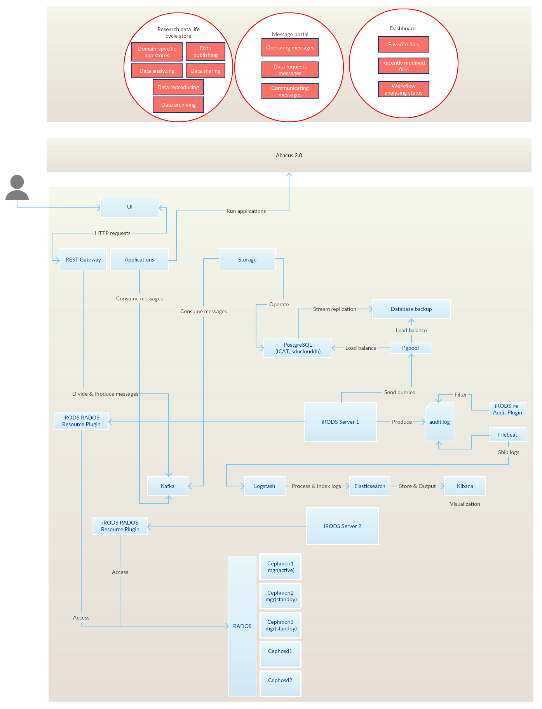

.. eScienceCloud documentation master file, created by
   sphinx-quickstart on Fri Aug 18 12:10:07 2017.
   You can adapt this file completely to your liking, but it should at least
   contain the root `toctree` directive.

Welcome to SDU Cloud's documentation!
=============================================

This documentation exists to provide an introduction of the  SDU Cloud. The project aims to provide easy access to national HPC infrastructures, like the Abacus 2.0 supercomputer,allowing a researcher to run complex or heavy computations on a supercomputer in a completely seamless and automatic way. 

Overview, by components
========================

* :doc:`/ansible`
* :doc:`/iRODS`
* :doc:`/ceph`
* :doc:`/irods_re_audit_plugin`
* :doc:`/elastic_stack`
* :doc:`/postgreSQL_server`
* :doc:`/pgpool_II`
* :doc:`/ui`

The usage descriptions, installations and configurations of each components are also availble by clicking the links. 

The diagram illustrates how components are connected with each other.
 

Also check where all the components are installed against the HPC nodes.

.. toctree::
   :maxdepth: 2
   :caption: Contents:
   
Indices and tables
==================

* :ref:`genindex`
* :ref:`modindex`
* :ref:`search`

